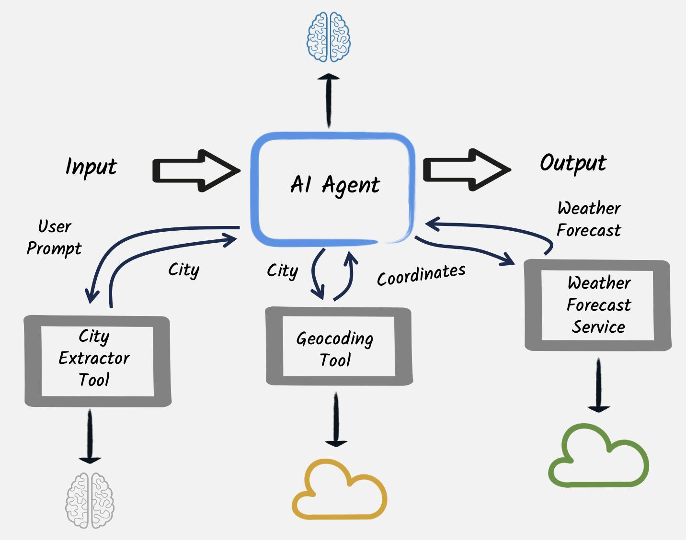
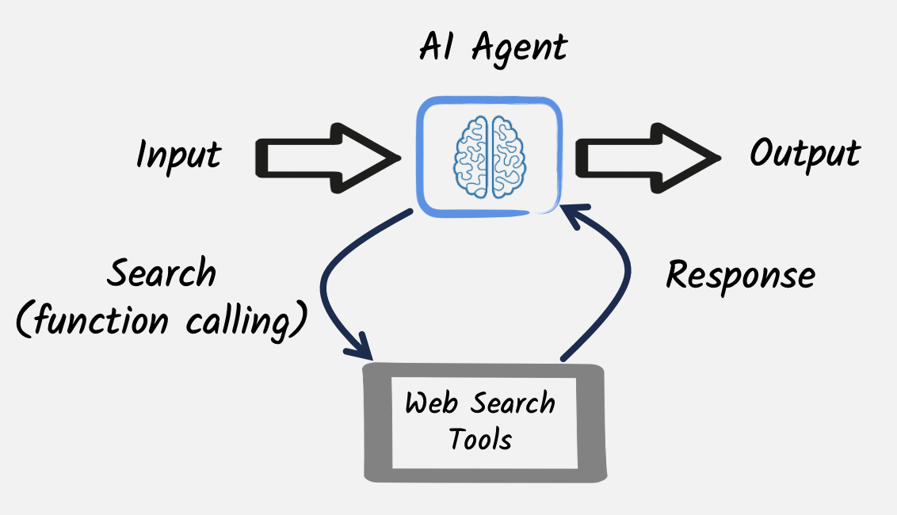

# Agentic AI with Quarkus

| Agentic Systems in a nutshell | 
|---| 
| Although there is no universally agreed definition of what an AI agent is, in practice several patterns are emerging that demonstrate how to coordinate and combine the capabilities of multiple AI services, in order to create AI-based systems that can accomplish more complex tasks. <br/><br/> According to a [recent article published by Antropic researchers](https://www.anthropic.com/research/building-effective-agents), these Agentic Systems architectures can be grouped in 2 main categories: **workflows**, where LLMs and tools are orchestrated through predefined code paths, and **agents**, where LLMs dynamically direct their own processes and tool usage, maintaining control over how they execute tasks. |


## Implementing workflow and agentic AI patterns with Quarkus

The idea of this project is discussing the most common workflow and agentic AI patterns and architectures, showing for each of them, with a very practical example, how they can be implemented through Quarkus and its LangChain4j integration. Of course a real-world application may use and combine these patterns in multiple ways in order to implement a complex behavior.

## Workflows

As anticipated AI workflows are pattern where the employment of different LLM-based services is programmatically coordinated in a predetermined way. This section explores a few of the simplest possible of these workflows. 

### Prompt chaining

Prompt chaining is probably the simplest, yet powerful and effective, technique in agentic AI workflows where the output of one prompt becomes the input for the next, enabling complex, multi-step reasoning or task execution. It is ideal for situations where there is a clear way to decompose a complex task, in smaller and better delimited parts, thus also reducing the possibilities of hallucinations or other LLMs misbehaving. 

A typical use case where to apply this technique is content creation, like advertising, or novel writing. For instance, this [first example](https://github.com/mariofusco/quarkus-agentic-ai/blob/main/src/main/java/org/agenticai/promptchaining) leverages this patterns to implement a creative writing and editing workflow, where a [first AI service](https://github.com/mariofusco/quarkus-agentic-ai/blob/main/src/main/java/org/agenticai/promptchaining/CreativeWriter.java) generates a draft of a story on a topic provided by the user, while subsequently a [second one](https://github.com/mariofusco/quarkus-agentic-ai/blob/main/src/main/java/org/agenticai/promptchaining/StyleEditor.java) rewrites the draft to make it more coherent with a determined style, and a [third one](https://github.com/mariofusco/quarkus-agentic-ai/blob/main/src/main/java/org/agenticai/promptchaining/AudienceEditor.java) execute a final edit to make it a good fit for the required audience.


In this case it is pretty straightforward to expose this service through a [rest endpoint](https://github.com/mariofusco/quarkus-agentic-ai/blob/main/src/main/java/org/agenticai/promptchaining/WriterResource.java) that simply invokes these AI services one after the other, making the editors to  rewrite or refine the content produced by the first creative writer.

The rest endpoint allows to define the topic, style and audience of the novel to be produced, so for example it would be possible to obtain a drama about dogs having kids as target audience calling this URL:

http://localhost:8080/write/topic/dogs/style/drama/audience/kids

thus generating a result like [this](https://github.com/mariofusco/quarkus-agentic-ai/blob/main/text/dogs-novel.txt). Since this project integrates out-of-the-box the observability capabilities provided by Quarkus, it is also possible to give a look at the tracing of the flow of invocations performed to fulfill this request that of course put in evidence the sequential nature of this pattern.  


### Parallelization

In other cases it may not be necessary to use the output of an LLM as the input for a subsequent request, but a complex task can however require to perform multiple, but independent, LLM calls. In these situations those calls can be performed in parallel, followed by an aggregator that combine their outcomes. 

To demonstrate how this could work this [second example](https://github.com/mariofusco/quarkus-agentic-ai/blob/main/src/main/java/org/agenticai/parallelization) has the purpose of suggesting a plan for a nice evening with a specific mood combining a movie and a meal that match that mood. The [rest endpoint](https://github.com/mariofusco/quarkus-agentic-ai/blob/main/src/main/java/org/agenticai/parallelization/EveningPlannerResource.java) achieving this goal calls 2 LLMs in parallel. The [first LLM](https://github.com/mariofusco/quarkus-agentic-ai/blob/main/src/main/java/org/agenticai/parallelization/MovieExpert.java) is a movie expert required to provide 3 titles of movies matching the given mood, while the [second one](https://github.com/mariofusco/quarkus-agentic-ai/blob/main/src/main/java/org/agenticai/parallelization/FoodExpert.java) is asked to do something similar providing 3 meals. When these LLM calls terminate the resulting 2 lists of 3 items each are aggregated to create a list of 3 amazing evening plans with a suggested movie and meal each.


For instance asking that endpoint to provide evening plans for a romantic mood:

http://localhost:8080/evening/mood/romantic

may result in a list like the following: 

```
[
  EveningPlan[movie=1. The Notebook, meal=1. Candlelit Chicken Piccata], 
  EveningPlan[movie=2. La La Land, meal=2. Rose Petal Risotto], 
  EveningPlan[movie=3. Crazy, Stupid, Love., meal=3. Sunset Seared Scallops]
]
```

In this case the tracing of the flow of invocations performed to fulfill this request shows, as expected, that the 2 LLM invocations are performed in parallel.


### Routing

Another common situation is the need of directing tasks, requiring a specific handling, to specialized models, tools, or processes based on determined criteria. In these cases the routing workflow allows to dynamically allocate tasks to the most suitable component.

[This example](https://github.com/mariofusco/quarkus-agentic-ai/blob/main/src/main/java/org/agenticai/routing) shows how this pattern could be applied in a simple scenario where a user asks a question that has to be redirected to a [legal](https://github.com/mariofusco/quarkus-agentic-ai/blob/main/src/main/java/org/agenticai/routing/LegalExpert.java), [medical](https://github.com/mariofusco/quarkus-agentic-ai/blob/main/src/main/java/org/agenticai/routing/MedicalExpert.java) or [technical](https://github.com/mariofusco/quarkus-agentic-ai/blob/main/src/main/java/org/agenticai/routing/TechnicalExpert.java) expert in order to be answered in the most accurate way. The categorization of the user's request is performed by [another LLM service](https://github.com/mariofusco/quarkus-agentic-ai/blob/main/src/main/java/org/agenticai/routing/CategoryRouter.java), so that the [router service](https://github.com/mariofusco/quarkus-agentic-ai/blob/main/src/main/java/org/agenticai/routing/RouterService.java) is able to send it to the right expert.


In this way when the user calls the [rest endpoint](https://github.com/mariofusco/quarkus-agentic-ai/blob/main/src/main/java/org/agenticai/routing/ExpertAssistanceResource.java) exposing this service writing something like: "I broke my leg what should I do", 

http://localhost:8080/expert/request/I%20broke%20my%20leg%20what%20should%20I%20do

the first LLM categorizes this request as a medical one and the router forward it to the medical expert LLM, thus generating a result like [this](https://github.com/mariofusco/quarkus-agentic-ai/blob/main/text/expert-response.txt).

## Agents

Agents differ from the workflow patterns discussed so far because the control flow is entirely delegated to LLMs, that typically invoke tools to complete determinate subtask, instead of being implemented programmatically. These tools can be seen as stateless functions, opportunistically invoked by the LLM to achieve its goal and implemented in a variety of different technologies, like simple imperative methods, external web services or even other LLMs.

### The weather forecast agent

This [first example](https://github.com/mariofusco/quarkus-agentic-ai/blob/main/src/main/java/org/agenticai/aiastool) of agentic AI implements a [weather forecast agent](https://github.com/mariofusco/quarkus-agentic-ai/blob/main/src/main/java/org/agenticai/aiastool/WeatherForecastAgent.java) using 3 different tools in sequence:

1. [another LLM](https://github.com/mariofusco/quarkus-agentic-ai/blob/main/src/main/java/org/agenticai/aiastool/CityExtractorAgent.java) specialized in extracting the name of a city from the user's prompt.
2.  a [web service](https://github.com/mariofusco/quarkus-agentic-ai/blob/main/src/main/java/org/agenticai/aiastool/geo/GeoCodingService.java) returning the geographic coordinates of a given city.
3. a [second web service](https://github.com/mariofusco/quarkus-agentic-ai/blob/main/src/main/java/org/agenticai/aiastool/weather/WeatherForecastService.java) providing the weather forecast for the given latitude and longitude.



It's possible to put at work the [rest endpoint](https://github.com/mariofusco/quarkus-agentic-ai/blob/main/src/main/java/org/agenticai/aiastool/WeatherResource.java) exposing this agent-based weather service, for example asking it what's the weather in Rome    

http://localhost:8080/weather/city/Rome

and receive an answer like the following.

```
The weather in Rome today will have a maximum temperature of 14.3°C, minimum temperature of 2.0°C. 
No precipitation expected, and the wind speed will be up to 5.6 km/h. 
The overall weather condition is expected to be cloudy.
```

In essence this control flow is quite similar to what described in the prompt chaining workflow, where the user input is sequentially transformed in steps (in this case going from the prompt, to the name of the city contained in that prompt, to the geographical coordinates of that city, to the weather forecasts at those coordinates), but as anticipated this time the major difference is in the fact that the sequence of steps is directly scheduled by the LLM instead of being externally orchestrated in a programmatic way. 

### A more general purpose AI agent

Using a bigger model ([this example](https://github.com/mariofusco/quarkus-agentic-ai/blob/main/src/main/java/org/agenticai/searchastool) has been configured with `qwen2.5-14b` and a longer timeout to give it a chance to complete its task) 

```properties
quarkus.langchain4j.ollama.big-model.chat-model.model-id=qwen2.5:14b
quarkus.langchain4j.ollama.big-model.chat-model.temperature=0
quarkus.langchain4j.ollama.big-model.timeout=600s
```

it is possible to dare to implement an AI agent with more freedom to operate, in order to make it capable to cover a larger range of tasks. This [intelligent agent](https://github.com/mariofusco/quarkus-agentic-ai/blob/main/src/main/java/org/agenticai/searchastool/IntelligentAgent.java) has been provided with only [one tool](https://github.com/mariofusco/quarkus-agentic-ai/blob/main/src/main/java/org/agenticai/searchastool/WebSearchService.java) that can perform a web search on DuckDuckGo and return the result in plain text. What the AI agent does is using this tool to retrieve online information for things that it ignores and put them together in order to provide an answer for a generic user question.

For instance we may want to ask `how many seconds would it take for a leopard at full speed to run through Pont des Arts` making a request to the [rest endpoint](https://github.com/mariofusco/quarkus-agentic-ai/blob/main/src/main/java/org/agenticai/searchastool/AgenticChatbotResource.java) exposing this service like it follows

http://localhost:8080/ask/how%20many%20seconds%20would%20it%20take%20for%20a%20leopard%20at%20full%20speed%20to%20run%20through%20Pont%20des%20Arts

To reply to this question the intelligent agent invokes the web search tool twice, once to find the length of Pont des Arts and once to retrieve the speed of a leopard



and then puts this information together generating an output like the following.

```
The length of Pont des Arts is approximately 155 meters. A leopard can run at speeds up to about 58 kilometers per hour (36 miles per hour). To calculate how many seconds it would take for a leopard running at full speed to cross the bridge, we need to convert its speed into meters per second and then divide the length of the bridge by this speed.

1 kilometer = 1000 meters
58 kilometers/hour = 58 * 1000 / 3600 ≈ 16.11 meters/second

Now, we can calculate the time it would take for a leopard to run through Pont des Arts:

Time (seconds) = Distance (meters) / Speed (m/s)
= 155 / 16.11
≈ 9.62 seconds

So, it would take approximately 9.62 seconds for a leopard running at full speed to run through Pont des Arts.
```

### Agents and Conversational AI

The flexibility of AI agents can become even more relevant when used in services not intended to fulfil a single request, but needing to have a longer conversation with the user in order to achieve their goal. For instance agents can function as chatbots, enabling them to handle multiple users in parallel, each with their own independent conversation. This requires managing the state of each conversation, often referred to as memories (the set of messages already exchanged with the LLM).

A [chatbot of a restaurant booking system](https://github.com/mariofusco/quarkus-agentic-ai/blob/main/src/main/java/org/agenticai/restaurant/RestaurantAgent.java), designed to chat with customers and collect their data and requirements, represents an interesting practical application of this pattern. When the agent completes that information gathering process, the chatbot uses a [tool accessing the database](https://github.com/mariofusco/quarkus-agentic-ai/blob/main/src/main/java/org/agenticai/restaurant/booking/BookingService.java) of existing reservations to both check if there is still a table available for the customers needs and to place a booking of that table if so. To assist the customer in deciding whether it is appropriate to eat outside or not, the agent can also reuse, as a second tool, the [weather forecast service](https://github.com/mariofusco/quarkus-agentic-ai/blob/main/src/main/java/org/agenticai/restaurant/weather/WeatherService.java) implemented in one of the former examples, passing to it the geographic coordinates of the restaurant.

```properties
restaurant.location.latitude=45
restaurant.location.longitude=5
```

The final architectural design of the chatbot could be visualized in this way.


Once the customer provides all necessary details, the chatbot confirms the booking and presents a summary of the reservation. and the final booking is then stored in the database. It is possible to give a try to this chatbot accessing the URL: 

http://localhost:8080/restaurant.html

and a typical example of user interaction could be something like this:

