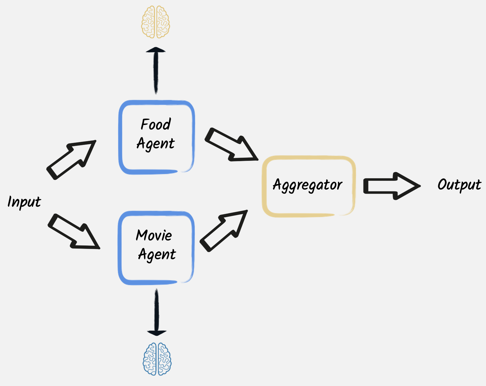

# Agentic AI with Quarkus

| Agentic Systems in a nutshell | 
|---| 
| Although there is no universally agreed definition of what an AI agent is, in practice several patterns are emerging that demonstrate how to coordinate and combine the capabilities of multiple AI services, in order to create AI-based systems that can accomplish more complex tasks. <br/><br/> According to a [recent article published by Antropic researchers](https://www.anthropic.com/research/building-effective-agents), these Agentic Systems architectures can be grouped in 2 main categories: **workflows**, where LLMs and tools are orchestrated through predefined code paths, and **agents**, where LLMs dynamically direct their own processes and tool usage, maintaining control over how they execute tasks. |


## Implementing agentic AI patterns with Quarkus

The idea of this project is discussing the most common agentic AI patterns and architectures, showing for each of them, with a very practical example, how they can be implemented through Quarkus and its LangChain4j integration. Of course a real-world application may use and combine these patterns in multiple ways in order to implement a complex behavior.

## Prompt chaining

Prompt chaining is probably the simplest, yet powerful and effective, technique in agentic AI workflows where the output of one prompt becomes the input for the next, enabling complex, multi-step reasoning or task execution. It is ideal for situations where there is a clear way to decompose a complex task, in smaller and better delimited parts, thus also reducing the possibilities of hallucinations or other LLMs misbehaving. 


A typical use case where to apply this technique is content creation, like advertising, or novel writing. For instance, this [first example](https://github.com/mariofusco/quarkus-agentic-ai/blob/main/src/main/java/org/agenticai/promptchaining) leverages this patterns to implement a creative writing and editing workflow, where a [first AI service](https://github.com/mariofusco/quarkus-agentic-ai/blob/main/src/main/java/org/agenticai/promptchaining/CreativeWriter.java) generates a draft of a story on a topic provided by the user, while subsequently a [second one](https://github.com/mariofusco/quarkus-agentic-ai/blob/main/src/main/java/org/agenticai/promptchaining/StyleEditor.java) rewrites the draft to make it more coherent with a determined style, and a [third one](https://github.com/mariofusco/quarkus-agentic-ai/blob/main/src/main/java/org/agenticai/promptchaining/AudienceEditor.java) execute a final edit to make it a good fit for the required audience.

In this case it is pretty straightforward to expose this service through a [rest endpoint](https://github.com/mariofusco/quarkus-agentic-ai/blob/main/src/main/java/org/agenticai/promptchaining/AudienceEditor.java) that simply invokes these AI services one after the other, making the editors to  rewrite or refine the content produced by the first creative writer.

The rest endpoint allows to define the topic, style and audience of the novel to be produced, so for example it would be possible to obtain a drama about dogs having kids as target audience calling this URL:

http://localhost:8080/write/topic/dogs/style/drama/audience/kids

thus generating a result like [this](https://github.com/mariofusco/quarkus-agentic-ai/blob/main/text/dogs-novel.txt). Since this project integrates out-of-the-box the observability capabilities provided by Quarkus, it is also possible to give a look at the tracing of the flow of invocations performed to fulfill this request that of course put in evidence the sequential nature of this pattern.  


## Parallelization

In other cases it may not be necessary to use the output of an LLM as the input for a subsequent request, but a complex task can however require to perform multiple, but independent, LLM calls. In these situations those call can be performed in parallel, followed by an aggregator that combine their outcomes. 



To demonstrate how this could work this [second example](https://github.com/mariofusco/quarkus-agentic-ai/blob/main/src/main/java/org/agenticai/parallelization) has the purpose of suggesting a plan for a nice evening with a specific mood combining a movie and a meal that match that mood. The [rest endpoint](https://github.com/mariofusco/quarkus-agentic-ai/blob/main/src/main/java/org/agenticai/parallelization/EveningPlannerResource.java) achieving this goal calls 2 LLMs in parallel. The [first LLM](https://github.com/mariofusco/quarkus-agentic-ai/blob/main/src/main/java/org/agenticai/parallelization/MovieExpert.java) is a movie expert required to provide 3 titles of movies matching the given mood, while the [second one](https://github.com/mariofusco/quarkus-agentic-ai/blob/main/src/main/java/org/agenticai/parallelization/FoodExpert.java) is asked to do something similar providing 3 meals. When these LLM calls terminate the resulting 2 lists of 3 items each are aggregated to create a list of 3 amazing evening plans with a suggested movie and meal each.

For instance asking that endpoint to provide evening plans for a romantic mood:

http://localhost:8080/evening/mood/romantic

may result in a list like the following: 

```
[
  EveningPlan[movie=1. The Notebook, meal=1. Candlelit Chicken Piccata], 
  EveningPlan[movie=2. La La Land, meal=2. Rose Petal Risotto], 
  EveningPlan[movie=3. Crazy, Stupid, Love., meal=3. Sunset Seared Scallops]
]
```

In this case the tracing of the flow of invocations performed to fulfill this request shows, as expected, that the 2 LLM invocations are performed in parallel.


## Routing

Another common situation is the need of directing tasks, requiring a specific handling, to specialized models, tools, or processes based on determined criteria. In these cases the routing workflow allows to dynamically allocate tasks to the most suitable component.


[This example](https://github.com/mariofusco/quarkus-agentic-ai/blob/main/src/main/java/org/agenticai/routing) shows how this pattern could be applied in a simple scenario where a user asks a question that has to be redirected to a [legal](https://github.com/mariofusco/quarkus-agentic-ai/blob/main/src/main/java/org/agenticai/routing/LegalExpert.java), [medical](https://github.com/mariofusco/quarkus-agentic-ai/blob/main/src/main/java/org/agenticai/routing/MedicalExpert.java) or [technical](https://github.com/mariofusco/quarkus-agentic-ai/blob/main/src/main/java/org/agenticai/routing/TechnicalExpert.java) expert in order to be answered in the most accurate way. The categorization of the user's request is performed by [another LLM service](https://github.com/mariofusco/quarkus-agentic-ai/blob/main/src/main/java/org/agenticai/routing/CategoryRouter.java), so that the [router service](https://github.com/mariofusco/quarkus-agentic-ai/blob/main/src/main/java/org/agenticai/routing/RouterService.java) is able to send it to the right expert.

In this way when the user calls the [rest endpoint](https://github.com/mariofusco/quarkus-agentic-ai/blob/main/src/main/java/org/agenticai/routing/ExpertAssistanceResource.java) exposing this service writing something like: "I broke my leg what should I do", 

http://localhost:8080/expert/request/I%20broke%20my%20leg%20what%20should%20I%20do

the first LLM categorizes this request as a medical one and the router forward it to the medical expert LLM, thus generating a result like [this](https://github.com/mariofusco/quarkus-agentic-ai/blob/main/text/expert-response.txt).